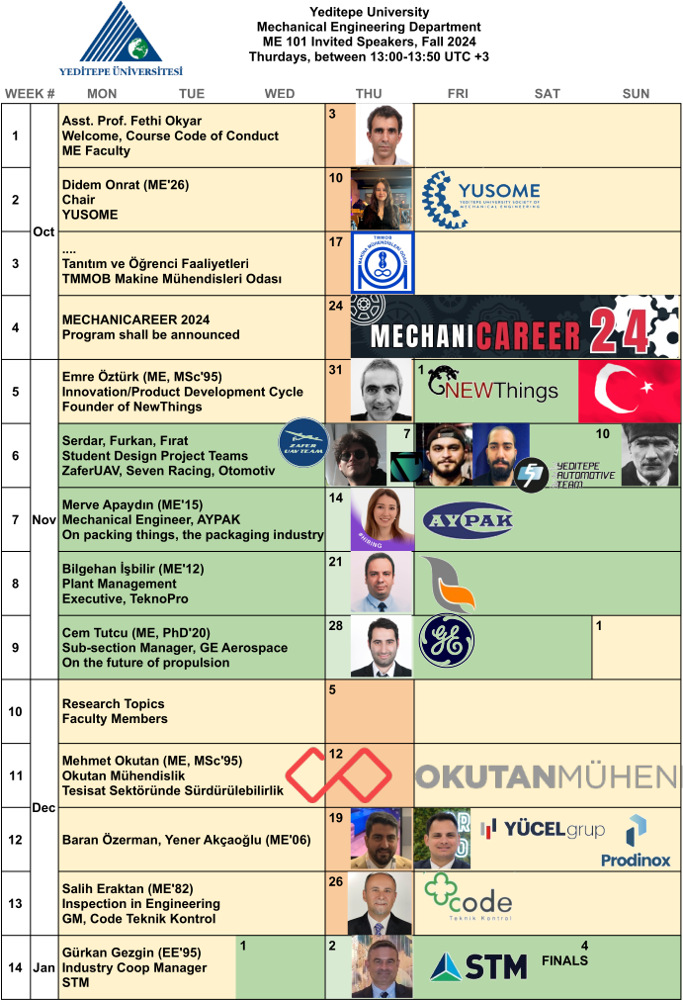

#+TITLE: ME 101 Introduction to MechEng
#+SUBTITLE: Fall 2024
#+AUTHOR: Fethi Okyar
#+STARTUP: overview
#+REVEAL_THEME: simple
#+REVEAL_INIT_OPTIONS: slideNumber:"c/t", width:1920, height:1080
#+REVEAL_TITLE_SLIDE: <h2>%t</h2> <h3>%s</h3> <h3>%a</h3>
#+OPTIONS: timestamp:nil toc:1 num:nil
#+REVEAL_EXTRA_CSS: ./mystyle.css
#+REVEAL_ROOT: https://cdn.jsdelivr.net/npm/reveal.js

* Syllabus 
** Goal
-  To equip students with an understanding of what mechanical engineering is and what mechanical engineers do and what the main disciplines in this field are. To let students gain an awareness of ethics, contemporary issues, engineers’ responsibilities and some legal issues related to engineering. To inform students of the University and Faculty rules and regulations.
** Contents
-  Orientation, rules and regulations at the University. Introduction to mechanical engineering, its history and related professional organizations. Ethics and implications in engineering ethics. Engineering communications. Engineering codes and standards. Academic report writing and presentation tools. Fundamentals of computer aided design. Fundamentals of freehand sketching. Introduction to scientific computing.
** CLOs
#+ATTR_REVEAL: :frag (appear appear appear ...)
1. Can perform simple computation using the computer
2. Able to explain the importance of engineering ethics
3. Able to draw free-hand sketches of simple objects
4. Able to create a simple CAD model
5. Assess impact of global challenges on the future of  profession
6. Conduct an experiment and acquire data
7. Use software applications to write engineering reports
8. Use software applications for data visualization
9. Awareness about the UN sustainability goals
10. Able to conduct a technical presentation
11. Demonstrate ability to reach institutional data sources
12. Awareness about innovation and enterpreneurship (added in 24'F)
13. Ability to function as member of a team (added in 24'F)

** Evaluation
| assignments  | 20 |
| classwork    | 25 |
| quizzes      | 15 |
| attendance   | 10 |
| final        | 30 |

** Weekly outline
#+REVEAL_HTML: 

| Week |  (Seminar) | Laboratory Session         |
|------+--------------------+----------------------------|
|    1 | Instructor         | 0.1 Academic Orientation   |
|    2 | Yusome             | 0.2 [[./cmpnt-orientation/orient.html::Personal Orientation][Personal Orientation]]   |
|    3 | MMO Representative | 0.3 Career Orientation     |
|    4 | Mechanicareer      | Mechanicareer              |
|    5 | [[file:sunumlar/ME101_Innovation_2024Fall.pdf][Emre Ozturk]]        | 1. [[file:./cmpnt-writing/writing.html][Academic Writing]]        |
|    6 | Racing Teams       | (cont'd)                   |
|    7 | Merve Apaydın      | 2. Solid Modeling          |
|    8 | Bilgehan İşbilir   | 3. [[./cmpnt-tabular/tabular.html][Tabulating Data]]         |
|    9 | Cem Tutcu          | (cont'd)                   |
|   10 | Research in us     | 4. Computer Familiarity    |
|   11 | Mehmet Okutan      | 4. A Programming Language  |
|   12 | Özerman/Akçaoğlu   | 5. Visualization/Sketching |
|   13 | Salih Eraktan      | 6. Experiment              |
|   14 | Gürkan Gezgin      | Presentation               |

** Resources
#+REVEAL_HTML: 

#+ATTR_REVEAL: :frag (appear appear appear ...)
- [[file:syllabusbolognaENME101.html][Bologna Syllabus]]
- ~README.org~ for each lecture
#+ATTR_REVEAL: :frag (appear appear appear ...)
- Software
  #+ATTR_REVEAL: :frag (appear appear appear ...)
  - CAD: Onshape: https://yeditepe.onshape.com
  - Math Programming: Octave: https://octave.org/download
  - Spreadsheet: MS/Libre Office
  - Word Processing: MS/Libre Office
#+REVEAL_HTML: 

