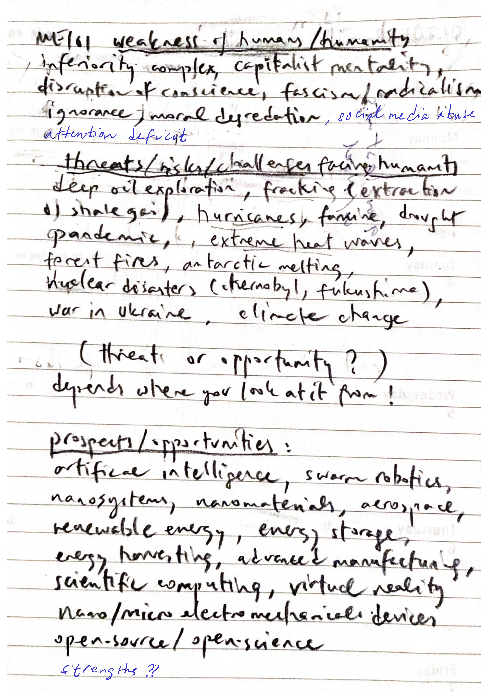
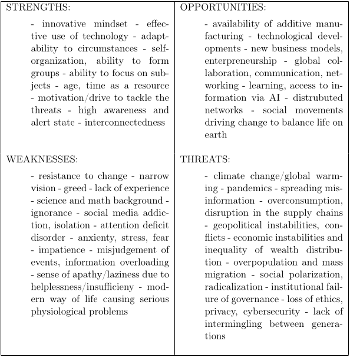
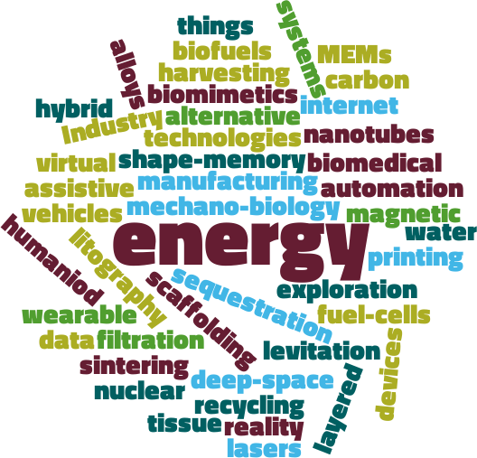

#+TITLE: ME 101: 2025 Fall
#+AUTHOR: Fethi Okyar
#+DATE: 2025-10-03
#+SUBTITLE: Component 0 Orientation
#+STARTUP: overview
#+REVEAL_THEME: simple
#+REVEAL_INIT_OPTIONS: slideNumber:"c/t", width:1920, height:1080
#+REVEAL_TITLE_SLIDE: <h2>%t</h2> <h3>%s</h3> <h4>%d</h4>
#+OPTIONS: timestamp:nil toc:1 num:nil
#+REVEAL_EXTRA_CSS: ../style.css
#+REVEAL_ROOT: https://cdn.jsdelivr.net/npm/reveal.js

* 0.1 Academic Orientation
** About the Academic System
#+ATTR_REVEAL: :frag (appear)
- How does education work?
- [[./0.w1AcademicOrientation.pdf]]

* 0.2 Personal Orientation (CLO5)
About the future, global issues, challenges on the one hand and opportunities, prospects on the other.
#+ATTR_HTML: :width 500px

** Lecture: What is a SWOT analyis?
#+ATTR_REVEAL: :frag (appear)
Use AI to describe the SWOT analysis. When, why, how is it useful? (Do not forget to provide the educational context while asking the question.) 

** Activity 1: Group Formation
#+ATTR_REVEAL: :frag (appear)
  We will form small groups of three students; you will be working closely with your teammates throughout the activity.

** Activity 2: Group Discussion: Global Impact on Life
#+ATTR_REVEAL: :frag (appear)
Focus: Future Prospects and Challenges
*** PROSPECTS
#+ATTR_REVEAL: :frag (appear)
1. What are the future trends in engineering and technology?
2. Which economic sectors will have a bright future?
3. What will be the role of technology in the future world?
   
*** CHALLENGES
#+ATTR_REVEAL: :frag (appear)
1. What are the greatest challenges facing the mankind?
2. How will climate change affect our lives in the future?
3. How shall the engineer’s role evolve into the future?

** Deliverables: Group SWOT of "Global Impact on Life"
#+ATTR_REVEAL: :frag (appear)
  + Provide the outline of your ideas in an A4 page prepared in typical SWOT format.
  + Upload the SWOT to the appropriate assignment in Yulearn

#+REVEAL: split

** Self-Study: The Rule/Role of Ethics
#+ATTR_REVEAL: :frag (appear)
What is ethics? Watch the videos below to prepare for next week's short quiz activity.
#+ATTR_REVEAL: :frag (appear appear appear ...)
- Here's a fascinating account of ethics (in Turkish):
  [[https://www.youtube.com/watch?v=Q88NhXSmK_I][Etik Değerler ve Eğitimi (Ethical Values)]] Ioanna Kuçuradi
- Another longer yet more detailed account (in Turkish)
  [[https://www.youtube.com/watch?v=g-MPvywIhJc&t=24s][Ahlaklar, Etik ve Etikler – Prof. Dr. İoanna Kuçuradi]]
- The universal declaration of human rights
  [[https://www.un.org/en/about-us/universal-declaration-of-human-rights]]
- Digital Ethics Canvas
  https://www.epfl.ch/education/educational-initiatives/cede/training-and-support/digital-ethics/

* 0.3 Career Orientation (CLO11)
#+ATTR_REVEAL: :frag (appear)
What is happening in mechanical engineering?
#+ATTR_HTML: :width 600px :style "display: block; margin: auto"

** Lecture: Sources of Information
#+ATTR_REVEAL: :frag (appear)
- In today's exercise, we will delve into the amusing world of mechanical engineering and explore various industrial sectors that are integral to the field.  As future engineers, it's vital to embrace life-long learning and stay updated on industry trends and knowledge. You will be asked to use your computers to access relevant industry news websites or databases to find recent news articles or reports about topics or issues that you find interesting.
- https://asme.org ASME
- https://imeche.org IMechE
- ScienceDirect
- DergiPark
- Aperta
- https://nature.org Nature Magazine
- https://www.science.org/journal/science Science Magazine
    
** Activity 1: Group Formation
#+ATTR_REVEAL: :frag (appear)
Find your previous group members; you will be working closely with your teammates throughout the activity.
#+ATTR_REVEAL: :frag (appear)
+ Select one group member as the secretary responsible from taking notes and uploading your work to the assignment.
+ Open an empty text file in an editor that you can use in the Windows OS (Use a simple editor such as notepad, wordpad, notepad++, emacs, etc.)
+ Select a topic/keyword that you found interesting in the lecture activity or the tag cloud below, and write it in your file that was created in the previous step.
+ Communicate with the instructor and reach an agreement upon a mutually agreed keyword.

** Activity 2: Group Discussion
#+ATTR_REVEAL: :frag (appear)
+ Search the internet about the keyword/topic using  the resources described in the previous activity.
+ Make a list of at least 5 references relevant to the keyword, and ask AI about how to enter these in an appropriate reference format. 
+ Based on the references you found above, write a paragraph in your text file describing the future prospects and challenges related with  your topic/keyword. 

** Deliverables: Group Work of "Keyword"
#+ATTR_REVEAL: :frag (appear)
Enter the text (maximum 600 words) in the appropriate space provided in the assignment: Classwork 2: Keyword Analysis for Next Session
Ask *AI*:
#+ATTR_REVEAL: :frag (appear)
- What is LaTeX?
- How to use computers to write a good engineering report?
